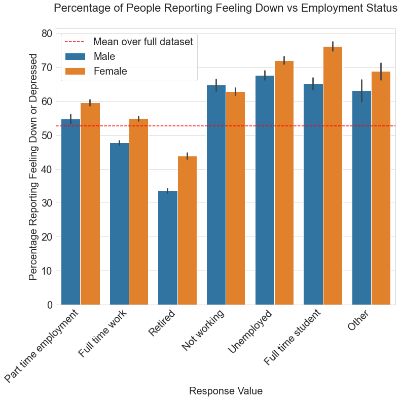

## Project Overview

Following warnings from the UN and the WHO that the pandemic has increased risk factors for suicide [[1](https://news.un.org/en/story/2021/09/1099572), [2](https://www.who.int/news-room/feature-stories/detail/facing-mental-health-fallout-from-the-coronavirus-pandemic)], the UK government approached our consultancy firm in order to identify the groups most at risk of mental health problems. These will be the targets of an upcoming awareness campaign.  

To do this, we analysed data from the Imperial College London/YouGov Covid-19 Behaviour Tracker Data Hub.

The dataset is designed to provide behavioural analysis on how different populations are responding to the pandemic by, every two weeks, anonymously surveying around a 1,000 people in each of around 12 countries around the world (the number can vary). 

The survey comprises more than 450 questions covering general behaviours, attitudes towards vaccination, country, age, number of people in the household, pre-existing health conditions, working status and mental health.  

Various techniques were then used in order to model whether a respondent would say they had felt depressed during the previous week, given their responses to the other questions.  

The best performing models were around 70% accurate, and caught around 75% of cases in which respondents said they had felt depressed.  

We then analysed the internal workings of the model to understand which factors were the strongest predictors of mental health problems, and which groups the government should target during its campaign.  

Creating a strong predictive model will also help tailor surveys for those interacting with country's National Health Service (NHS), which could help identify individuals at risk without having to ask outright. This is an advantage as sometimes those who are suffering from issues are reluctant to say so.  

The UK's Covid taskforce shares its insights with other governments, so any findings of international discrepancies are also of interest to us.  

 
 

### Business Problem

To identify the groups most at risk from mental health problems in the pandemic for an upcoming UK government awareness campaign.  

This involves creating a strong predictive model, and also inferring from the workings of the model which factors most increase the odds of someone suffering mental health issues.  

Our insights can also be used by the NHS to flag up any high-risk cases, without having to directly quiz them about this highly-sensitive issue. 

Any findings of international interest can be shared with the relevant governments. 

 
 

### The Data

Data drawn from the Imperial College London/YouGov Covid-19 Behaviour Tracker Data Hub.

https://github.com/YouGov-Data/covid-19-tracker

The dataset comprises surveys of more than 450 questions answered by hundreds of thousands of respondents from 29 countries around the world.

There was variation in which questions were posed by different countries, and which countries provided regular data.

Infrequently answered questions, and repetitious ones, were removed from the dataset, leaving 44 questions that covered the main issues surrounding personal circumstances and attitudes towards the pandemic.

We focussed on the 11 countries that provided the most comprehensive responses. These were: Australia, Canada, Denmark, France, Germany, Italy, Norway, Spain, the UK and the US.

 
 

### Methods

The final dataset of almost 130,000 records was analyzed to find the strength of relationships between the responses to each question and the response to the question 'at any point during the last week, have you been feeling down, depressed, or hopeless?'.  

The end goal was to create an accurate model, and to find out which factors were given the heaviest weighting by the most accurate models.  

To do this, we created a series of models using logistic regression, decision trees, random forests and gradient boosting.

Each model was then put to the test with previously unseen data, and its performance calculated in terms of how accurately it could predict whether a respondent would answer 'yes' or 'no' to the target question.  

We were also interested in how many of those answering 'yes' that the model caught.  

If used by the NHS to flag up potential high-risk cases, we could sacrifice some accuracy in order to increase this number and make it less likely we miss those who are suffering from problems.  

Each model was tuned to maximise its performance, and the results of the best two models were analysed to find the most important factors across both.

 
 

### Headline Results

 

 
 

* Those whose lives had been most affected by the pandemic were more likely to report mental health issues, suggesting they were triggered by the virus and the response to it.
 

* Age and gender are key factors with younger people and females most at risk of depression. Being female increased the odds or reporting symptoms by 30 percent.
 
 

 
 

* People who did not go out often or see many other people from outside their households were more likely to suffer from depression.
 

* Living in Italy increased the odds of reporting depression by around 53 percent.
 

* Being a student or unemployed was a strong predictor of mental health issues.  
 

 
 

### Conclusion

This analysis leads to the following recommendations for the government in its upcoming mental health awareness campaign.

* Work with student services at major universities to raise awareness of symptoms, and who to contact for help. A similar campaign should be coordinated with job centres across the country.

* Run television, Facebook and Instagram campaigns targeting young people, but particularly young women.

* Consider introducing financial incentives for people to eat out or join social/sports clubs.

* Inform the Italian authorities of the levels of mental health problems reported by people living there.

 
 

### Next steps

* Tailor a new questionnaire focussed on the key factors identified in the models. Each factor needs to be explored in more detail to produce a more granular model.

* Once we have a high-performing model, we can then produce a concise survey for the NHS to offer those who use its services. This can be used to flag up individuals at high risk of suffering mental health problems without having to directly question them about this highly-sensitive issue.

* Although we found that there was a strong link between those whose lives had been affected most by the virus and mental health problems, we need to analyse pre-pandemic data to identify pre-existing predictive factors. This will help us more accurately model whether the mental health of certain groups has been disproportionately affected by the pandemic.

* There were sparse responses to questions about working from home, which made them unusable. We should conduct our own survey on this issue, as it is potentially an important factor that has only arisen during the last two years.

* There appears to be evidence from the models that pre-existing conditions such as arthritis, HIV and asthma have a significant effect but there were too few positive cases in the dataset to make a definitive statement. We should encourage charities dealing with those diseases to conduct surveys. The responses would help us make a more robust model.

* The responses on vaccine uptake and hesitancy were also a little inconsistent as different countries were at different stages in their vaccination programs over the duration of the survey. Now countries are on more of an even footing, we should conduct a survey focussed on issues surrounding access and attitudes to vaccines and mental health.

* We need to further analyse existing data on which groups are more reluctant to admit feeling depressed. Our data is anonymised, but it is still likely that some of those suffering from problems did not report it. This will obviously limit the effectiveness of our model.
 
 
